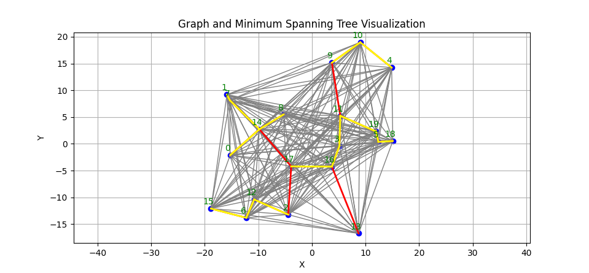

# Lab 5 — Graph Algorithms: Clustering

🇷🇺 Пятая лабораторная работа по дисциплине **«Алгоритмы и структуры данных»**.  
Задача: реализовать начальный шаг алгоритма кластеризации точек на плоскости с использованием графовых методов.  

🇬🇧 Fifth lab work for the course **“Algorithms and Data Structures”**.  
Task: implement the initial step of clustering points on a plane using graph algorithms.  

---

## 📋 Условие / Task

Дано `N` случайно сгенерированных точек на плоскости.  
Необходимо:  
1. Сгенерировать `N` точек (координаты x, y).  
2. Рассмотреть точки как вершины **полного взвешенного графа**, где веса рёбер = расстояния между точками.  
3. Построить **минимальный остов** (алгоритм Прима).  
4. Отсортировать рёбра остова по весам.  
5. По первым `N - K` рёбрам построить матрицу смежности и выделить `K` компонент связности (кластеры).  
6. Для каждого кластера:  
   - вывести число вершин,  
   - минимальные и максимальные координаты,  
   - координаты центроида (вершины с минимальной суммой расстояний до других в кластере).  

Given `N` randomly generated points on a plane.  
The goal is to:  
1. Generate `N` points (coordinates x, y).  
2. Consider the points as vertices of a **complete weighted graph**, where edge weights = distances between points.  
3. Construct a **minimum spanning tree** (Prim's algorithm).  
4. Sort the MST edges by weight.  
5. Using the first `N - K` edges, build an adjacency matrix and identify `K` connected components (clusters).  
6. For each cluster:  
   - output the number of vertices,  
   - the minimum and maximum coordinates,  
   - the centroid coordinates (vertex with the minimal sum of distances to all others in the cluster).  

---

## 🛠 Реализация / Implementation

- Используется структура `Dot { x, y }` для точек.  
- Построение матрицы расстояний (`FormationOfMatrix`).  
- Алгоритм Прима (`AlgorithmPrima`) для нахождения минимального остова.  
- Сортировка рёбер остова (Shell Sort).  
- Разбиение на кластеры с помощью поиска компонент связности (`get_comp`).  
- Подсчёт границ кластеров и вычисление центроидов.  
- Результаты сохраняются в файлы:  
  - `dots.txt` — точки  
  - `tree.txt` — рёбра остова  
  - `clusters.txt` — рёбра кластеров  

Дополнительно реализован **Python-скрипт** для визуализации:  
- точки (синие)  
- все рёбра графа (серые)  
- рёбра минимального остова (красные)  
- рёбра кластеров (жёлтые)  

- Uses the structure `Dot { x, y }` for points.  
- Constructs a distance matrix (`FormationOfMatrix`).  
- Prim's algorithm (`AlgorithmPrima`) to find the minimum spanning tree.  
- Sorting of MST edges (Shell Sort).  
- Cluster detection using connected components search (`get_comp`).  
- Calculates cluster boundaries and centroids.  
- Results are saved to files:  
  - `dots.txt` — points  
  - `tree.txt` — MST edges  
  - `clusters.txt` — cluster edges  

Additionally, a **Python script** is implemented for visualization:  
- points (blue)  
- all graph edges (gray)  
- MST edges (red)  
- cluster edges (yellow)  

---

## 📊 Визуализация / Visualization

  
*Рис. 1 — Пример графа с остовом и кластерами (графический результат) / Example of a graph with MST and clusters (graphical result)*

🔵 точки (вершины) / points (vertices)

⚪ серые рёбра — полный граф / gray edges — complete graph

🔴 красные рёбра — минимальный остов / minimum spanning tree

🟡 жёлтые рёбра — кластеры / yellow edges — clusters

## 🎯 Цель работы / Purpose

🇷🇺 Ознакомление с графовыми алгоритмами (минимальный остов, связные компоненты) и их применением для кластеризации данных.

🇬🇧 Introduction to graph algorithms (minimum spanning tree, connected components) and their application in data clustering.
